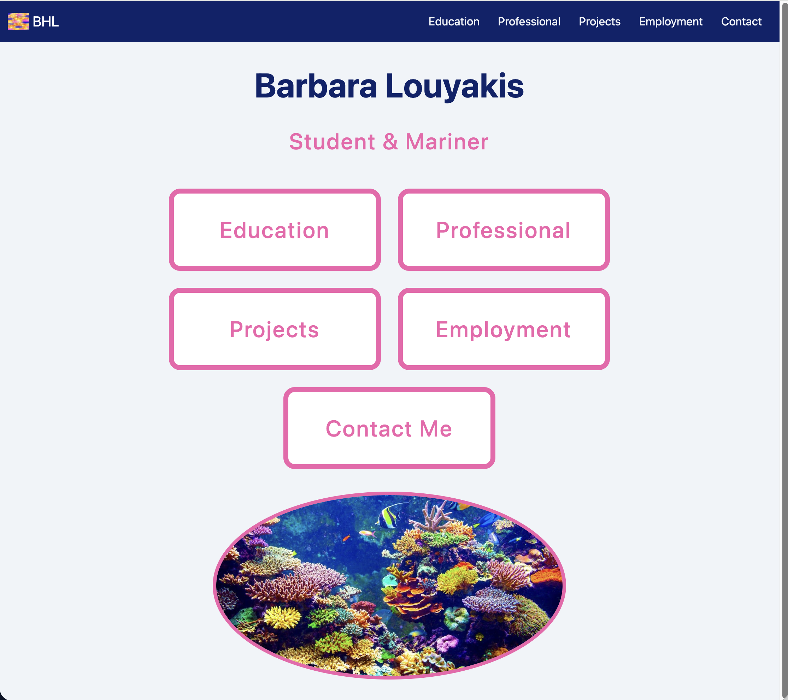
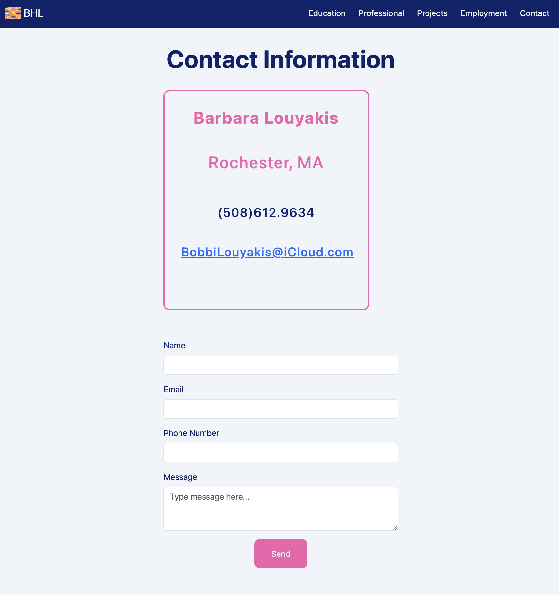
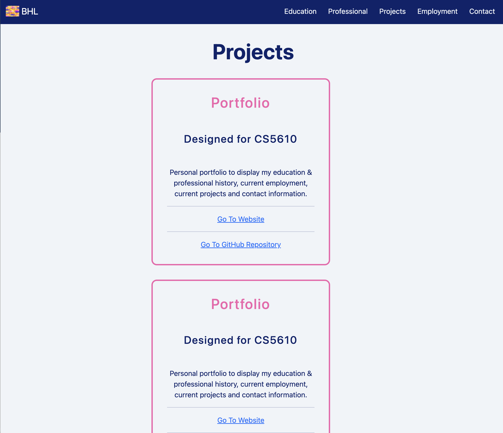
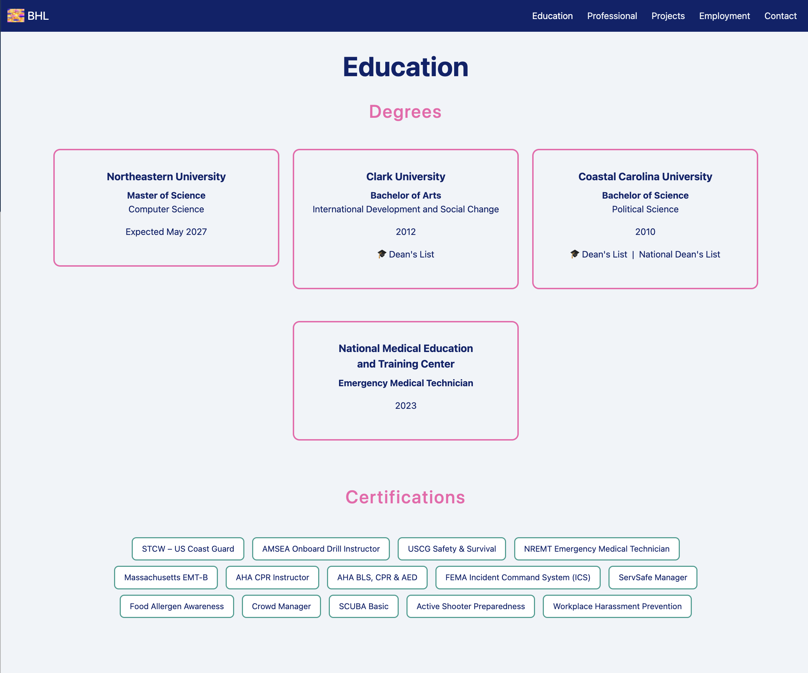
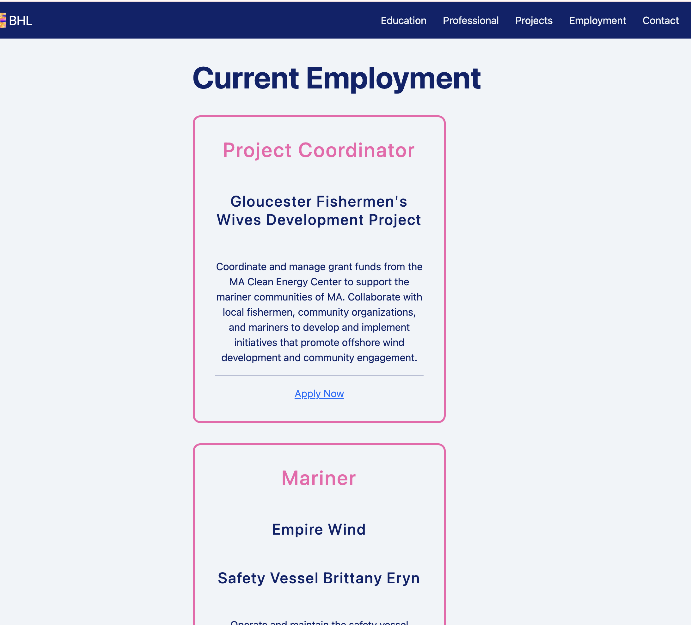
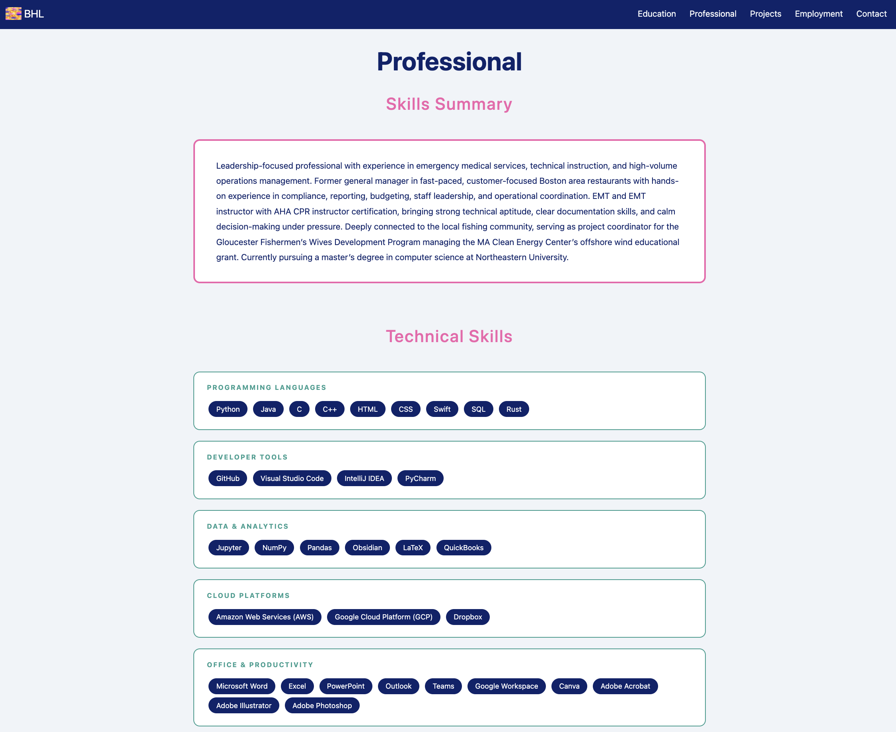
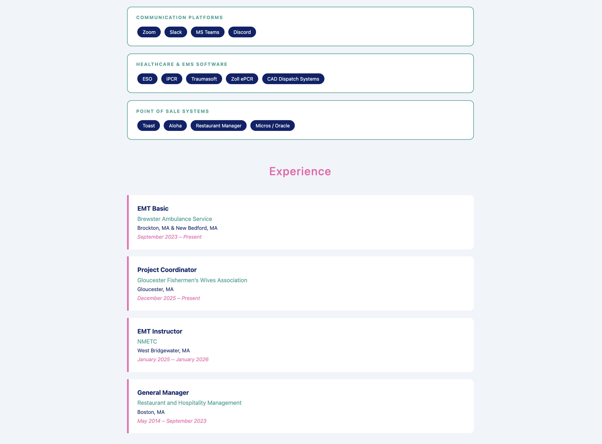
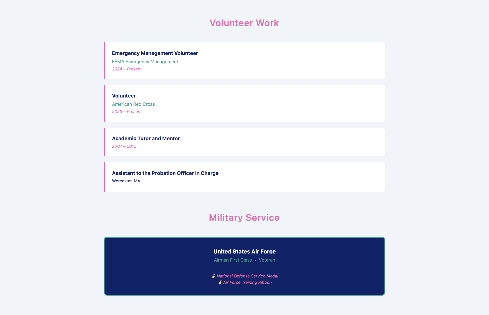
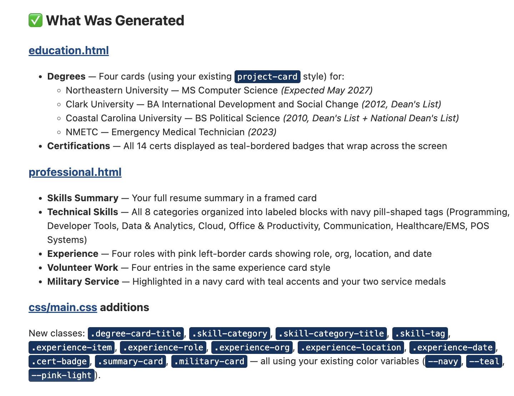

# Barbara Louyakis | Portfolio

A personal portfolio and resume website for Barbara Louyakis
---

## Project Objective

Create a personal portfolio that displays my education & professional work, current employment, current projects and contact information
---

## Screenshots

---

## Tech Requirements

- HTML5
- W3C Compliant
- CSS3 with custom styling
- JavaScript Vanilla ES6
- Bootstrap 5.3.8 grid & navbar
- ESLint
- Prettier
- Google Fonts (Amethysta)
---

## How to install/use

- Clone the repository: git clone https://blouyakis.github.io/barbaralouyakis.git
- Go to the project folder: cd barbaralouyakis
- Install dependencies: npm install
- Run a local server: live-server 
---

## Author 

Barbara Louyakis | Portfolio (https://blouyakis.github.io/barbaralouyakis/)
---

## Class Reference

This project was designed & developed for CS5610 Web Development at Northeastern University.
CS5610 Web Development (https://johnguerra.co/classes/webDevelopment_online_summer_2026/)
---

## Design Document

See the full design document here (./DESIGN.md)
---

## Video Demonstration

Watch the demonstration video (...)
---

## Slide Presentation

View the Google Slide presentation (...)
---

## GenAI Usage

The 'Professional' & 'Employment' pages were developed using AI tools:
Claude (Anthropic) Sonnet 4-6 used to code the required AI generated pages
Prompts used:
- Prompt: "I want you to role play as a professional web developer. I will share my resume with you. I want you to use the information from my resume to generate the education.html & professional.html pages."

---

## License

This project is licensed under the MIT License - see (./LICENSE) for details.
---
